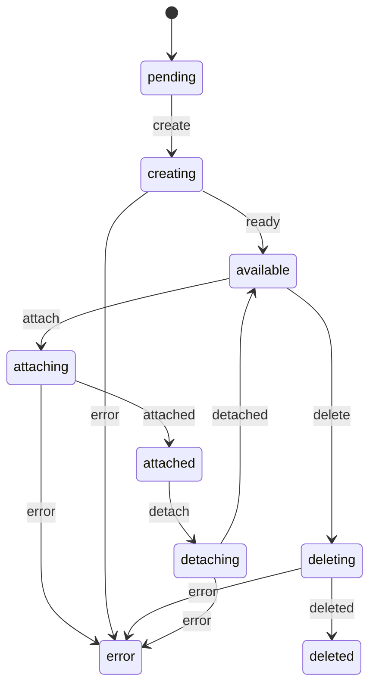
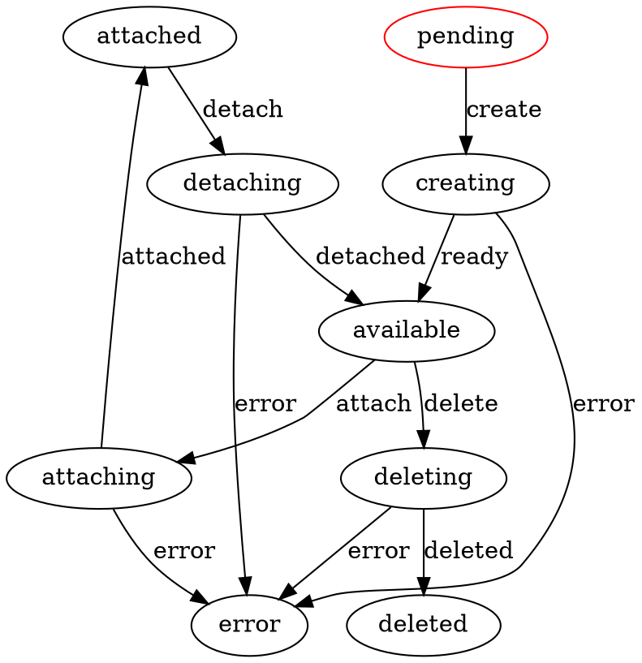

# Volume FSM — Lifecycle

Initial state: `pending`

## States

- `pending` — volume created, waiting for provisioning
- `creating` — provisioning in progress on the backend
- `available` — ready to be attached or deleted
- `attaching` — attachment in progress to a node
- `attached` — attached to a compute node
- `detaching` — detachment in progress
- `deleting` — deletion in progress
- `deleted` — permanently deleted
- `error` — unrecoverable error

## Transitions

| Event | From | To |
|-------|------|----|
| `create` | `pending` | `creating` |
| `ready` | `creating` | `available` |
| `error` | `creating \| attaching \| detaching \| deleting` | `error` |
| `attach` | `available` | `attaching` |
| `attached` | `attaching` | `attached` |
| `detach` | `attached` | `detaching` |
| `detached` | `detaching` | `available` |
| `delete` | `available` | `deleting` |
| `deleted` | `deleting` | `deleted` |

## Mermaid diagram

## Graphviz diagram (DOT)

